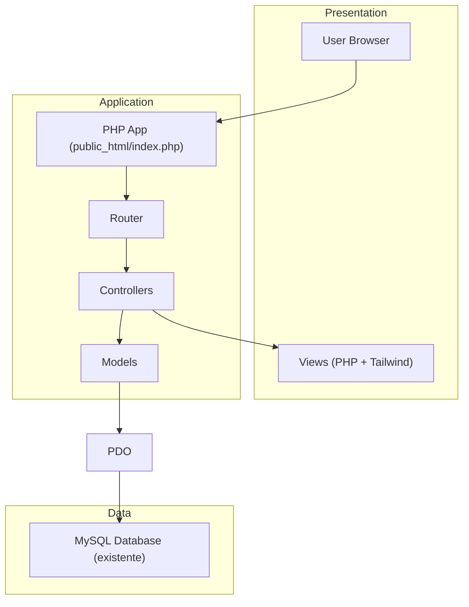
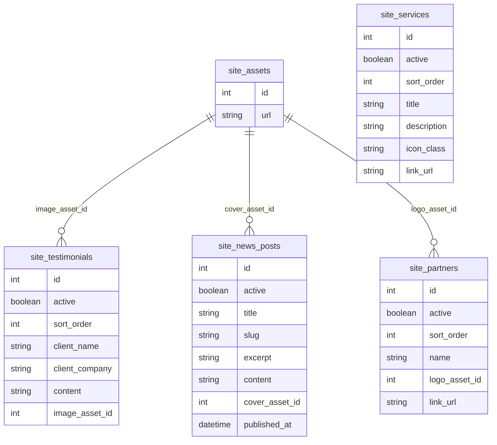

## 1.Architecture design

## 2.Technology Description
- Frontend: HTML renderizado no servidor (Views PHP) + tailwindcss@3.4 (build CSS) + JavaScript (vanilla)
- Backend: PHP@8.2 (MVC leve) + PDO (MySQL)
- Database: MySQL existente (sem alterações de schema)

## 3.Route definitions
| Route | Purpose |
|---|---|
| / | Home (landing atual) com links atualizados para páginas internas |
| /sobre | Página “A CT Price” (conteúdo institucional reutilizando layout atual) |
| /servicos | Página de listagem completa de serviços (site_services) |
| /clientes | Página de clientes/parceiros (site_partners + diretório de imagens) |
| /depoimentos | Página de depoimentos (site_testimonials) |
| /noticias | Página de notícias (site_news_posts) |
| /partners/load-more | Endpoint existente para rotação de clientes/parceiros (manter como está) |

## 6.Data model(if applicable)
### 6.1 Data model definition
Sem mudanças no banco. As páginas novas devem consumir as tabelas já existentes:
- site_services
- site_testimonials (com imagem via site_assets)
- site_news_posts (com capa via site_assets)
- site_partners (com logo via site_assets)
- site_assets

