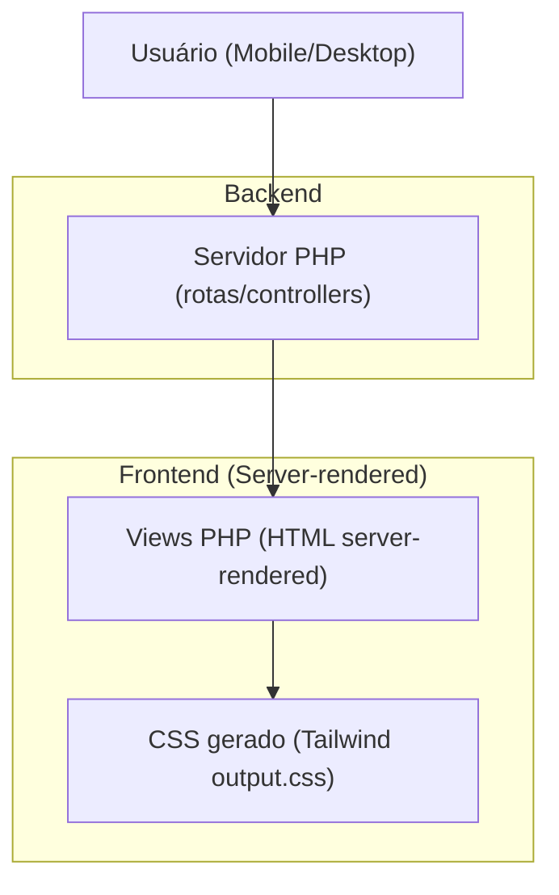

## 1.Architecture design

## 2.Technology Description
- Frontend: PHP Views (server-rendered) + TailwindCSS@3 (build para `public/assets/css/output.css`)
- Backend: PHP (MVC simples, controllers + router)
- Backend adicional: None

## 3.Route definitions
| Route | Purpose |
|---|---|
| / | Página institucional (Home) |
| /sobre | Página institucional |
| /servicos | Página institucional |
| /parceiros | Página institucional |
| /clientes | Página institucional |
| /depoimentos | Página institucional |
| /noticias | Página institucional |
| /fale-conosco | Formulário de contato |
| /login | Autenticação (área interna) |
| /dashboard (e demais internas) | Telas internas (tabelas, fluxos e operações) |

## 4.API definitions (If it includes backend services)
N/A (não é necessário criar APIs novas para este esforço de UI/UX).

## 6.Data model(if applicable)
N/A.

### Notas de implementação (diretrizes técnicas essenciais)
- **Mobile-first**: classes/tokens devem partir do menor breakpoint; usar variantes (`md:`, `lg:`) apenas para expandir layout.
- **Sistema de espaçamentos**: consolidar valores em tokens (Tailwind `theme.extend.spacing` e/ou CSS variables em `@layer base`).
- **Alvos 44px**: padronizar utilitários/componentes para botões/ícones/itens clicáveis (ex.: `min-h-[44px] min-w-[44px] px-4`), incluindo espaçamento entre targets.
- **Transições 200–300ms**: padronizar `duration-200`/`duration-300` e easing; garantir fallback com `prefers-reduced-motion`.
- **Contraste 4.5:1**: manter paleta/tokens de cor revisados; evitar texto sobre imagens sem overlay/box.
- **Testes**: manter um checklist reproduzível por rota/breakpoint e anexar evidência antes/depois.
