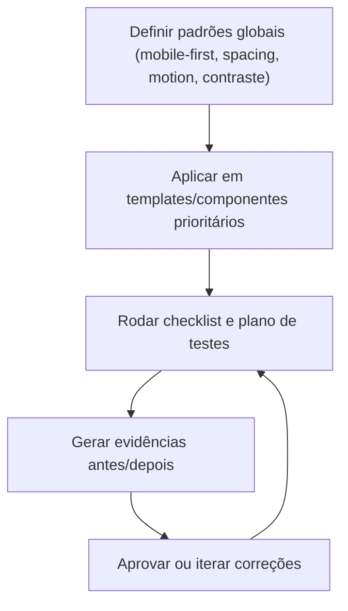

## 1. Product Overview
Otimizar a UI/UX do projeto inteiro com abordagem **mobile-first**, garantindo consistência visual, acessibilidade e previsibilidade de responsividade.
Padroniza motion (200–300ms), espaçamentos, alvos de toque (44px) e contraste (≥ 4.5:1), com plano de testes e evidências antes/depois.

## 2. Core Features

### 2.2 Feature Module
Este esforço de UI/UX exige as seguintes “páginas” (artefatos) essenciais:
1. **Padrões Globais de UI (Mobile-first + A11y)**: breakpoints, container, tipografia, sistema de espaçamentos, alvos 44px, contraste, estados de foco/erro, motion 200–300ms.
2. **Checklist & Plano de Testes**: matriz de dispositivos, regressão visual, testes de interação/toque/teclado, verificação de contraste e relatórios.
3. **Evidências Antes/Depois**: baseline, comparativos por breakpoint e checklist de aprovação.

### 2.3 Page Details
| Page Name | Module Name | Feature description |
|---|---|---|
| Padrões Globais de UI (Mobile-first + A11y) | Responsividade | Definir breakpoints e comportamento mobile-first (layout empilhado no mobile; grids/colunas apenas em larguras maiores). |
| Padrões Globais de UI (Mobile-first + A11y) | Sistema de espaçamentos | Padronizar escala (ex.: 4/8/12/16/24/32/40/48/64) e regras de uso (stack vertical, gutters, gaps, padding de cards/sections). |
| Padrões Globais de UI (Mobile-first + A11y) | Alvos de toque (44px) | Garantir área clicável mínima de 44x44px em botões, links, ícones e itens de lista (inclui padding extra e espaçamento entre alvos). |
| Padrões Globais de UI (Mobile-first + A11y) | Motion (200–300ms) | Padronizar transições (200–300ms) para hover/focus/expand/collapse; respeitar `prefers-reduced-motion` (reduzir/zerar animações). |
| Padrões Globais de UI (Mobile-first + A11y) | Contraste (≥4.5:1) | Validar cores de texto/ícones/controles e estados (default/hover/focus/disabled/erro) com contraste mínimo 4.5:1. |
| Padrões Globais de UI (Mobile-first + A11y) | Estados e feedback | Definir estados consistentes: hover (desktop), active (toque), focus-visible (teclado), loading (botões), erro (inputs), sucesso (mensagens). |
| Checklist & Plano de Testes | Matriz responsiva | Testar em larguras-chave (ex.: 360, 390, 414, 768, 1024, 1280+) e em orientação retrato/paisagem quando aplicável. |
| Checklist & Plano de Testes | Acessibilidade prática | Verificar navegação por teclado, ordem de foco, foco visível, labels/aria em formulários, e checar contraste. |
| Checklist & Plano de Testes | Regressão visual | Comparar antes/depois por página e breakpoint; validar espaçamentos, quebras de linha, overflow horizontal e legibilidade. |
| Evidências Antes/Depois | Baseline e captura | Capturar screenshots “antes” e “depois” (mesmas larguras) com checklist do que deve melhorar/manter; versionar imagens e notas. |
| Evidências Antes/Depois | Aprovação | Registrar decisão (aprovado/pendente), lista de correções e evidência final por breakpoint. |

## 3. Core Process
Fluxo principal (time):
1) Definir/atualizar padrões globais (tokens de espaçamento, cores e motion) com foco em mobile-first.
2) Aplicar padrões em componentes e templates prioritários, removendo inconsistências (ex.: gaps, padding, alvos pequenos, overflow).
3) Executar checklist de testes (responsividade, toque, teclado, contraste) e registrar bugs.
4) Gerar evidências antes/depois por breakpoint e obter aprovação.

