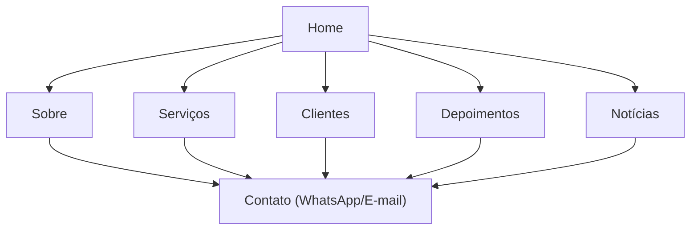

## 1. Product Overview
Site institucional da CT Price com Home e páginas internas dedicadas (Sobre, Serviços, Clientes, Depoimentos, Notícias).
Você quer criar as páginas que hoje existem apenas como seções/âncoras na Home, **refatorando apenas o layout** (largura/spacing/tipografia/breakpoints) e **sem alterar fluxo, arquitetura ou banco**.

Restrições de layout desta refatoração:
- Containers (estilo Elementor): **1140px (desktop)**, **1024px (tablet)** e **767px (mobile)**.
- Gutters (padding horizontal do container): **10px**.
- Espaçamento de widgets/itens: **20px**.
- Hero: **min-height 640px** e padding interno **50px (desktop)** / **30px (mobile)**.

## 2. Core Features

### 2.2 Feature Module
1. **Home**: hero e CTAs, seções-resumo, ajustes de menu/links para páginas internas.
2. **Sobre (A CT Price)**: conteúdo institucional (história/valores/diferenciais) com CTA de contato.
3. **Serviços**: listagem completa de serviços (do banco) no mesmo card layout.
4. **Clientes**: grade de logos/parceiros (banco + diretório) com rotação/carregar mais.
5. **Depoimentos**: grid de depoimentos com vídeo (mesmo layout da Home).
6. **Notícias**: listagem de posts com imagem, título e resumo (do banco).

### 2.3 Page Details
| Page Name | Module Name | Feature description |
|---|---|---|
| Home | Menu e links | Atualizar header/footer e CTAs para apontar para páginas (ex.: /sobre, /servicos, /clientes, /depoimentos, /noticias) ao invés de âncoras; manter identidade visual. |
| Home | Seções-resumo | Exibir previews de Sobre/Serviços/Clientes/Depoimentos/Notícias como hoje, adicionando links “Ver mais” para as páginas correspondentes. |
| Sobre | Conteúdo institucional | Apresentar textos e blocos visuais já usados na seção “Sobre a CT Price”; incluir CTA para WhatsApp/E-mail. |
| Serviços | Listagem de serviços | Renderizar serviços ativos do banco (título, descrição, ícone), mantendo o grid e cards atuais. |
| Clientes | Logos e rotação | Renderizar parceiros/clientes ativos (banco + imagens do diretório), mantendo grid e botão “Carregar mais”. |
| Depoimentos | Lista e mídia | Renderizar depoimentos ativos (nome, empresa, texto, imagem) e suporte a vídeo/overlay igual ao atual. |
| Notícias | Listagem | Renderizar posts ativos e publicados (imagem, título, excerpt, data); permitir acesso ao conteúdo completo dentro da própria página (ex.: expansão/âncora interna) sem criar novo tipo de página. |

## 3. Core Process
Fluxo do visitante:
1) Entra na Home e usa o menu para ir às páginas internas.
2) Em Serviços, avalia ofertas e clica no CTA para contato.
3) Em Clientes e Depoimentos, valida confiança/credibilidade e retorna ao CTA.
4) Em Notícias, navega por posts e lê o conteúdo completo dentro da página.

